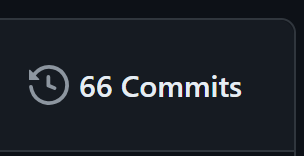
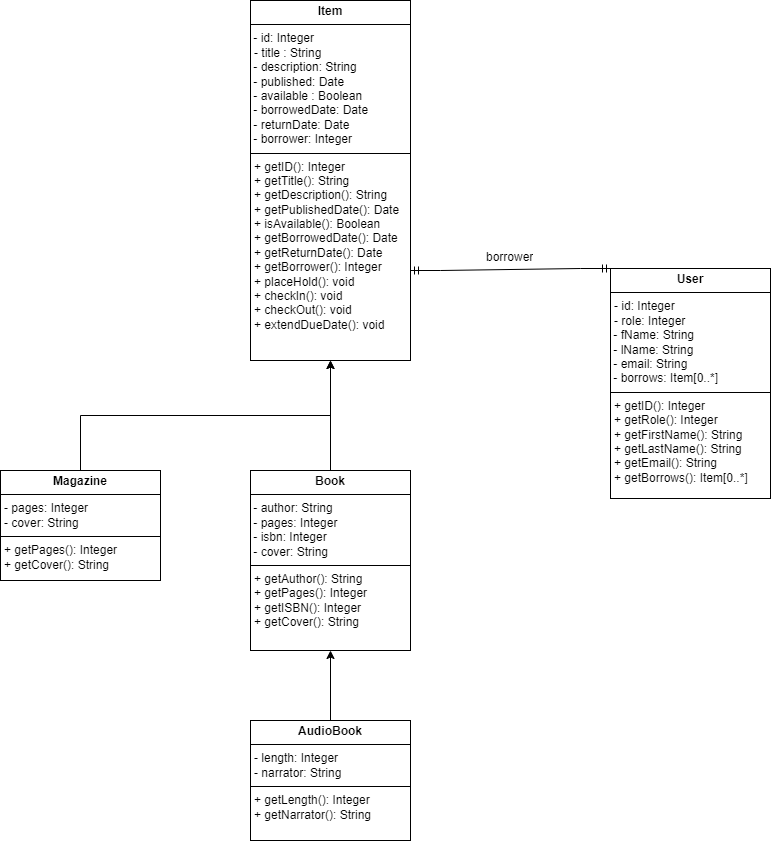
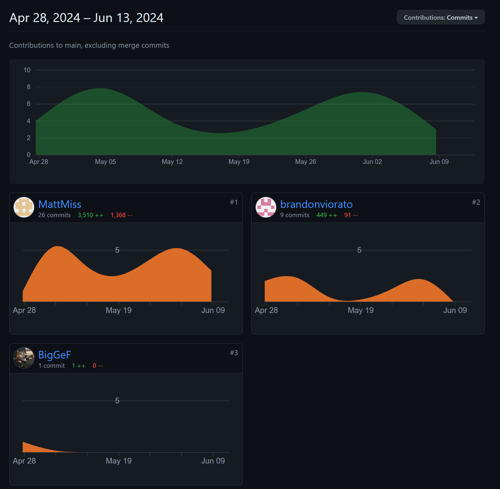

# Public Library by Team EZ

## A project title and description

### Website URL
https://mattmiss.greenriverdev.com/SDEV328/public_library_TeamEZ/

### Github Repo
https://github.com/BigGeF/public_library_TeamEZ/

## Authors
- Matt Miss
- Hao Fan
- Brandon Viorato

## Project Requirements
### 1) Separates all database/business logic using the MVC pattern.
Database in contained within the DataLayer class while all logic is within the Controller class. 
All HTML pages are in the Views.

### 2) Routes all URLs and leverages a templating language using the Fat-Free framework.
All routes are defined in the index.php and routed with Fat-Free within the controller.php. HTML pages in the Views 
all use Fat-Free templating.

### 3) Has a clearly defined database layer using PDO and prepared statements.
Database is instantiated inside the DataLayer and never used outside the DataLayer class. All statements and queries 
use PDO with prepared statements.

### 4) Data can be added and viewed.
Library items can be searched and added to a users borrow list. Items are added to the Database and can be removed by 
returning an item.

### 5) Has a history of commits from both team members to a Git repository. Commits are clearly commented.

- **Hao - 30 commits**
- **Matt - 27 commits**
- **Brandon - 9 commits**

- ### 6) Uses OOP, and utilizes multiple classes, including at least one inheritance relationship.
User class used for all users. Item class is the parent class for all library items. Book class and Magazine class 
both inherit from the item class. The Audiobook class inherits from the Book class. Each class contains only 
the properties and methods needed for that class.

- ### 7) Contains full Docblocks for all PHP files and follows PEAR standards.
All PHP files are commented with PEAR standards

- ### 8) Has full validation on the server side through PHP.
Login, Signup, and Contact forms all have server-side validation. Errors are shown in each form.

- ### 9) All code is clean, clear, and well-commented. DRY (Don't Repeat Yourself) is practiced.
Code used throughout the site, such as the header file, are included in each file in order to keep the files clean and 
easy to edit in a single place.

- ### 10) Your submission is professional and shows adequate effort for a final project in a full-stack web development course.
Many late nights have been put into this project from all members.

## Your most current UML class diagram

## Your temporary admin login username and password, if applicable
**User Login (with some borrowed items)**
- Username: john.doe@example.com
- Password: password1234

**Admin Login**
- Username: admin@admin@example.com
- Password: password1234

## A report from GitHub (Insights -> Contributors) showing the commits from each team member
- **Report unfortunately does not reflect Hao Fan's 27 contributions correctly**

